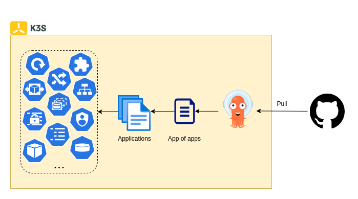
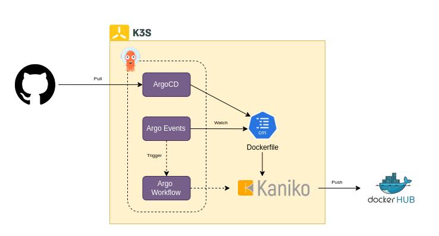

# Continuous Integreation & Delivery (CI/CD)

CI/CD has become one of the most important process when building a system. It helps to avoid bugs and code failures while maintaining a continuous cycle of software development and updates. This page describe how we implement CI/CD flow in fabricator. 

## 1. The Argo Project
The Argo project provides a set of open source tools for Kubernetes to run workflows, manage clusters, and do GitOps right. The following featured tools are helpful for our CI/CD flow:
- [Argo CD](https://argoproj.github.io/cd/) - Declarative continuous delivery with a fully-loaded UI
- [Argo Events](https://argoproj.github.io/events/) - Event based dependency management for Kubernetes
- [Argo Workflows](https://argoproj.github.io/workflows/) - Kubernetes-native workflow engine supporting DAG and step-based workflows

## 2. CI/CD Flow
The management of tools and services within the k3s cluster is facilitated through the use of Helm charts. The core concept is relatively straightforward: an Argo CD server is deployed inside the k3s cluster, which periodically synchronizes with a GitHub repository. Argo CD orchestrates the deployment process by leveraging custom resources, specifically the Application CRD, which defines the Helm chart source along with its associated configuration values. Based on this information, Argo CD renders the necessary Kubernetes manifests and applies them to the cluster in an automated manner. This architecture exemplifies a pull-based CI/CD approach, whereby the cluster proactively retrieves deployment configurations from a version-controlled repository, enhancing reliability, traceability, and operational consistency.

<u>*Why pull-based CI/CD?*</u>\
GitOps workflows typically require mutual accessibility between the target deployment system and the source code management platform. In our current setup, source code is maintained on GitHub rather than on a self-hosted repository within the k3s cluster, primarily due to resource constraints. Consequently, an outbound-only connection to GitHub has been adopted as the practical approach for synchronizing configurations. Although a push-based mechanism could theoretically be implemented by exposing the Kubernetes API endpoint to the public internet, such a solution would introduce unnecessary complexity and overhead, particularly in terms of authentication and security layers. Under these circumstances, a pull-based CI/CD model presents a more appropriate and efficient alternative, aligning well with the system’s architectural and operational limitations.

## 3. Packaging
Most mainstream tools and services are designed to be compatible with a variety of operating systems, such as Linux and Windows, across multiple architectures including ARM64 and AMD64. However, this level of compatibility does not always extend to platforms like the Raspberry Pi, which serves as the underlying system for the Fabricator. For instance, while Fluent Bit offers support for both ARM64 and AMD64, its official builds are compiled on systems with a 4KB memory page size, which renders them incompatible with the Raspberry Pi 5, a device that utilizes a 16KB page size by default. Although the Raspberry Pi 5 technically allows switching to a 4KB page size, such a change may introduce performance trade-offs, potentially affecting Fluent Bit, the Raspberry Pi itself, or both. To address this limitation, a custom packaging workflow has been developed to produce tailored builds optimized for the Fabricator environment, ensuring compatibility and stable performance.

