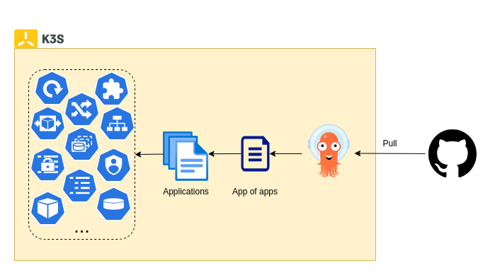
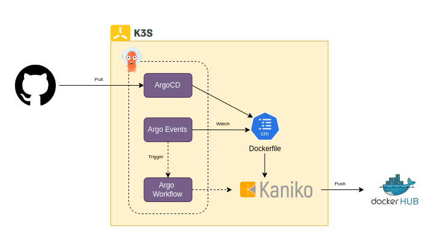

# Continuous Integreation & Delivery (CI/CD)

CI/CD has become one of the most important process when building a system. It helps to avoid bugs and code failures while maintaining a continuous cycle of software development and updates. This page describe how we implement CI/CD flow in fabricator. 

## 1. The Argo Project
The Argo project provides a set of open source tools for Kubernetes to run workflows, manage clusters, and do GitOps right. The following featured tools are helpful for our CI/CD flow:
- [Argo CD](https://argoproj.github.io/cd/) - Declarative continuous delivery with a fully-loaded UI
- [Argo Events](https://argoproj.github.io/events/) - Event based dependency management for Kubernetes
- [Argo Workflows](https://argoproj.github.io/workflows/) - Kubernetes-native workflow engine supporting DAG and step-based workflows

## 2. CI/CD Flow
The management of tools and services within the k3s cluster is facilitated through the use of Helm charts. The core concept is relatively straightforward: an Argo CD server is deployed inside the k3s cluster, which periodically synchronizes with a GitHub repository. Argo CD orchestrates the deployment process by leveraging custom resources, specifically the Application CRD, which defines the Helm chart source along with its associated configuration values. Based on this information, Argo CD renders the necessary Kubernetes manifests and applies them to the cluster in an automated manner. This architecture exemplifies a pull-based CI/CD approach, whereby the cluster proactively retrieves deployment configurations from a version-controlled repository, enhancing reliability, traceability, and operational consistency.



<u>*Why pull-based CI/CD?*</u>\
GitOps workflows typically require mutual accessibility between the target deployment system and the source code management platform. In our current setup, source code is maintained on GitHub rather than on a self-hosted repository within the k3s cluster, primarily due to resource constraints. Consequently, an outbound-only connection to GitHub has been adopted as the practical approach for synchronizing configurations. Although a push-based mechanism could theoretically be implemented by exposing the Kubernetes API endpoint to the public internet, such a solution would introduce unnecessary complexity and overhead, particularly in terms of authentication and security layers. Under these circumstances, a pull-based CI/CD model presents a more appropriate and efficient alternative, aligning well with the system’s architectural and operational limitations.

## 3. Packaging
Most mainstream tools and services are designed to be compatible with a variety of operating systems, such as Linux and Windows, across multiple architectures including ARM64 and AMD64. However, this level of compatibility does not always extend to platforms like the Raspberry Pi, which serves as the underlying system for the Fabricator. For instance, while Fluent Bit offers support for both ARM64 and AMD64, its official builds are compiled on systems with a 4KB memory page size, which renders them incompatible with the Raspberry Pi 5, a device that utilizes a 16KB page size by default. Although the Raspberry Pi 5 technically allows switching to a 4KB page size, such a change may introduce performance trade-offs, potentially affecting Fluent Bit, the Raspberry Pi itself, or both. To address this limitation, a custom packaging workflow has been developed to produce tailored builds optimized for the Fabricator environment, ensuring compatibility and stable performance.



## 4. Core deployments with GitHub Actions

The core services (`cert-manager`, `external-secrets`, `cloudflared`, `argo-cd`) are managed by
Helmfile rather than Argo CD, so they get a push-based workflow of their own:
[`.github/workflows/core.yml`](../.github/workflows/core.yml).

| Job | Trigger | What it does |
| --- | --- | --- |
| `validate` | `pull_request` targeting `master` (opened / synchronize / reopened) | Runs `helmfile template` in `core/`, rendering all four child helmfiles through the parent `core/helmfile.yaml`. Nothing touches the cluster. |
| `deploy` | `push` to `master`, i.e. a merged PR | Runs `helmfile apply` in `core/` after a manual approval on the `production` environment. |

Concurrency is deliberately asymmetric: `validate` uses a per-PR group with
`cancel-in-progress: true` so superseded runs release their runner, while `deploy` uses the single
`core-apply-master` group with `cancel-in-progress: false` so applies serialise and an in-flight
apply is never killed. The `GITHUB_TOKEN` is read-only (`permissions: contents: read`).

### 4.1 Runners and cluster authentication

Both jobs use `runs-on: arc`, the [ARC](https://github.com/actions/actions-runner-controller) scale
set installed from `core/arc` (see [`provisioning/playbook.yml`](../provisioning/playbook.yml)).
The runner pods live inside the target cluster, so `helm`, `helmfile` and `kubectl` pick up the
in-cluster config from the pod's projected ServiceAccount token — there is no kubeconfig and no
stored cluster credential.

`core/arc/templates/runner-rbac.yaml` creates the `arc-runner` ServiceAccount in the `arc`
namespace and binds it to the built-in `cluster-admin` ClusterRole (the core releases install CRDs
and cluster-scoped objects; this is an accepted home-lab trade-off).
`core/arc/values.yaml` sets `gha-runner-scale-set.template.spec.serviceAccountName: arc-runner`.
Both ship with the arc chart, so the existing ARC install task applies them:

```bash
cd provisioning && task provision   # playbook.yml, tag prepare_core_service
```

### 4.2 Runner image

The workflow installs no tooling — `helm`, `kubectl`, `helmfile` and the `helm-diff` plugin
(required by `helmfile apply`) are baked into the runner image at pinned versions by
[`docker/arc-runner/Dockerfile`](../docker/arc-runner/Dockerfile):

```bash
docker buildx build --platform linux/arm64 \
  --tag ghcr.io/sondn98/fabricator-arc-runner:2.336.0 \
  --push docker/arc-runner
```

Then point `gha-runner-scale-set.template.spec.containers[0].image` in `core/arc/values.yaml` at
the pushed tag and redeploy the arc chart. Versions are `ARG`s, so a bump is
`--build-arg HELM_VERSION=v3.21.4` and so on.

### 4.3 Required GitHub secrets

Every secret value is injected as an environment variable and pulled in with `requiredEnv` at
render time — the same pattern `core/external-secrets/bitwarden/ma-access-token.yaml` already uses.
Nothing is written to disk, and a missing variable aborts the run with
``required env var `X` is not set`` instead of rendering an empty Secret. The workflow sets all
three at job level in **both** jobs, because templating needs them just as much as applying does.

| Secret | Contents | Consumed by |
| --- | --- | --- |
| `CERT_MANAGER_CA_TLS_CRT` | CA certificate, **raw PEM** as generated | `core/cert-manager/secrets.yaml` |
| `CERT_MANAGER_CA_TLS_KEY` | CA private key, **raw PEM** as generated | `core/cert-manager/secrets.yaml` |
| `BITWARDEN_MA_ACCESS_TOKEN` | Bitwarden machine-account token, **raw** | `core/external-secrets/bitwarden/ma-access-token.yaml` |

All three go in verbatim — paste the PEM straight out of the file, no pre-encoding step. The
templates apply `| b64enc` themselves, which is what the Secret's `data` field needs. GitHub
secrets keep multi-line values intact, so the PEM survives the round trip unchanged.

Generating the CA pair (`core/cert-manager/openssl.cnf` holds the extensions; the same commands sit
at the top of `core/cert-manager/secrets.yaml`):

```bash
openssl genrsa -out core/cert-manager/ca/tls.key 2048
openssl req -x509 -nodes -new -sha256 -days 365 \
  -key core/cert-manager/ca/tls.key \
  -extensions v3_ca \
  -out core/cert-manager/ca/tls.crt \
  -config core/cert-manager/openssl.cnf
```

A local `task core` needs the same three variables, so export them before running helmfile by hand
— quoted, since the PEM is multi-line:

```bash
export CERT_MANAGER_CA_TLS_CRT="$(cat core/cert-manager/ca/tls.crt)"
export CERT_MANAGER_CA_TLS_KEY="$(cat core/cert-manager/ca/tls.key)"
```

The `ca/` files are now just a convenient place to keep the material — no helmfile reads them.

Every remaining `readFile` target under `core/` (`argo-cd/config.yaml`, `argo-cd/repos.yaml`,
`cert-manager/secrets.yaml`, `external-secrets/bitwarden/*.yaml`) is tracked in git and present in
a fresh checkout, so nothing else needs injecting.

### 4.4 Required environment

The `deploy` job targets a GitHub Environment named **`production`**. Create it under
*Settings → Environments* and enable the **required reviewers** protection rule, otherwise the
apply runs unattended immediately after merge. The three secrets above can live either at the
repository level or on the `production` environment — but `validate` also needs them, so
repository-level secrets (optionally overridden per environment) are the simpler setup.

### 4.5 Known risk: `helmDefaults.verify: true`

`core/helmfile.yaml` sets `verify: true`. If an upstream chart is published without a provenance
(`.prov`) file, both `helmfile template` and `helmfile apply` fail signature verification in CI.
The helmfiles are intentionally left untouched here. If this surfaces, the options are to supply
provenance for the affected charts or to explicitly relax `verify` — a maintainer decision, not
something the workflow should work around.

