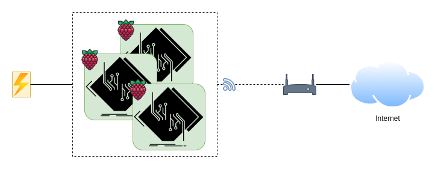

# Hardware

As part of a homelab initiative, Fabricator is designed to leverage a diverse range of hardware devices, irrespective of their resource capacities. While a high-performance PC equipped with abundant RAM and a powerful CPU offers significant advantages, even resource-constrained devices such as the Raspberry Pi can seamlessly participate in the cluster. In this particular setup, a cluster of three Raspberry Pi 5 units has been deployed, demonstrating the system’s flexibility and scalability across heterogeneous computing environments.

## 1. Server

- Model: Raspberry Pi 5
- CPU: 64-bit ARM Cortex-A76, 4 vCores
- RAM: 16Gb
- Storage: 64Gb SD Card

## 2. Network
