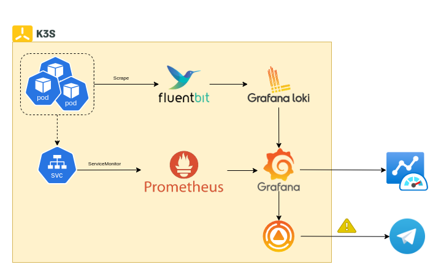

# Observability system
Observability plays a pivotal role in identifying anomalies and potential issues within a system, enabling administrators to address problems proactively. By facilitating early detection and resolution, observability ensures that the system remains operational, stable, and resilient over time. 
The observability framework for Fabricator is structured around two core components: metrics and logs, which collectively provide comprehensive insights into system performance and behavior.

## 1. Metrics

## 2. Logs
